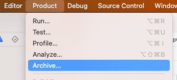
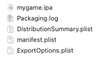

### Unity 侧

#### ipa 包体构建流程

1. 在 Mac 上启动 Unity，在 Unity 的 BuildSettings 界面选择 iOS 平台，点击 Build 按钮后即开始导出 XCode 工程。或调用 Unity 命令行工具完成此步操作。


导出后的 Xcode 工程结构如下图


2.双击 Unity-iPhone.xcodeproj，打开 Xcode，在 Xcode 顶部栏点击 Product/Archive 开始构建档案。或调用 Xcode 命令行工具完成此步操作。



3.在 Xcode 顶部栏点击 Window/Organizer 进行分发，根据出包需求选择不同的证书导出对应 ipa 安装包文件。或调用 Xcode 命令行工具完成此步操作。


最终导出的 ipa 文件和日志文件如下图



总结：对于使用 Unity 开发的游戏，每次打包都相当于重新产生一个 Xcode 工程。当游戏的美术资源，代码文件，配置文件发生变更后，通常需要重新导出一份新的 Xcode 工程。

#### Unity 工程目录结构简介

不同游戏的 Unity 目录结构不同，其中 Unity 对一些目录做了特殊定义，此类文件夹不能更名，否则 Unity 会识别不到。

以下列举了一个 Unity 游戏工程的大概目录结构（加粗的为 Unity 特殊定义的目录名）

**Assets**

**Library**  //Unity 针对 Assets 下的文件生成的适合自身读写的中间文件

**Packages**  //存放 Unity Package Manager 扩展包文件

**ProjectSettings**  //存放 Unity 项目设置文件

**Temp**  //存放临时文件，随 Unity 进程关闭被清空

#### 创建桥接文件

1.在 **Assets/Plugins/iOS** 目录下创建以下文件（文件名称随意）

2.编辑 MyAppController.h（属于各 Unity 项目的通用做法，网上有很多示例）

注意点：

（1）必须继承自 UnityAppController

```cpp
//
//  MyAppController.h
//  Unity-iPhone
//

#ifndef MyAppController_h
#define MyAppController_h
#import "UnityAppController.h"

@interface MyAppController : UnityAppController
- (NSString*)BOOLToNSString:(BOOL)val;
@end

#endif /* MyAppController_h */
```

3.编辑 MyAppController.mm（也属于各 Unity 项目的通用做法，网上有很多示例）

注意点：

（1）最后一行必须写 IMPL_APP_CONTROLLER_SUBCLASS，这是 Unity 提供的宏。Unity 通过这个宏知道要使用我们定制的 MyAppController 而不是使用默认的 UnityAppController。

（2）新建的函数必须在对应的头文件里提前声明

```cpp
//
//  MyAppController.mm
//  Unity-iPhone
//

#import <Foundation/Foundation.h>
#import <UIKit/UIKit.h>
#import "MyAppController.h"
#import "UnityAppController.h"
#import <SDK/SDK.h>
#import "UnityInterface.h"

@implementation MyAppController

//注册app生命周期函数，调用对应的sdk代码
//例如重载程序启动成功之后自动调用的方法
- (BOOL)application:(UIApplication *)application didFinishLaunchingWithOptions:(NSDictionary *)launchOptions {
    [[NSNotificationCenter defaultCenter] addObserver:self selector:@selector(paySuc:) name:kPaySuccNotification object:nil];
    [[NSNotificationCenter defaultCenter] addObserver:self selector:@selector(payFail:) name:kPayErrorNotification object:nil];
    return [[SDK instance] application:application didFinishLaunchingWithOptions:launchOptions];
}

//也可以写自己开发的代码，BOOL转NSString*，函数需要提前在MyAppController.h声明
- (NSString*) BOOLToNSString:(BOOL)val
{
    if(val == true)
    { return @"true"; }
    return @"false";
}

- (void)paySuc:(NSNotification *)notify
{
    if(logToggle)
    { NSLog(@"paySuc:%@", notify.object); }
    NSString *str =  [notify.object description];
    char* arg0 = (char*)[[NSString stringWithFormat:@"paySuc#%@", str] cStringUsingEncoding:NSUTF8StringEncoding];
    UnitySendMessage("IosMessageReceiver", "Call", arg0);
}

- (void)payFail:(NSNotification *)notify
{
    if(logToggle)
    { NSLog(@"payFail:%@",notify.object); }
    NSString *str =  [notify.object description];
    char* arg0 = (char*)[[NSString stringWithFormat:@"payFail#%@", str] cStringUsingEncoding:NSUTF8StringEncoding];
    UnitySendMessage("IosMessageReceiver", "Call", arg0);
}

@end

IMPL_APP_CONTROLLER_SUBCLASS(MyAppController);//*以MyAppController为启动项
```

4.编辑 NativeCallProxy.h

```cpp
//
//  NativeCallProxy.h
//  Unity-iPhone
//

#ifndef NativeCallProxy_h
#define NativeCallProxy_h

#import <Foundation/Foundation.h>
#import "NativeCallProxy.h"
@protocol NativeCallsProtocol

@required

@end

__attribute__ ((visibility("default")))

@interface FrameworkLibAPI : NSObject
// call it any time after UnityFrameworkLoad to set object implementing NativeCallsProtocol methods
+(void) registerAPIforNativeCalls:(id<NativeCallsProtocol>) aApi;

extern BOOL logToggle;

@end

@interface NativeCallProxy : NSObject

@end

#endif /* NativeCallProxy_h */
```

5.编辑 NativeCallProxy.mm

注意点：

(1)被 C#调用的代码必须用 extern "C"包围

```cpp
//
//  NativeCallProxy.m
//  Unity-iPhone
//

#import <Foundation/Foundation.h>
#import "NativeCallProxy.h"
#import "MyAppController.h"

@implementation FrameworkLibAPI

id<NativeCallsProtocol> api = NULL;
+(void) registerAPIforNativeCalls:(id<NativeCallsProtocol>) aApi
{
    api = aApi;
}

BOOL logToggle = true;         //全局变量：日志开关

@end

extern "C" {

char* invokeMethod(const char *method, const char *arg0);
char* makeStringCopy(const char* string);
char* pay(const char* data);
char* toggleLog(const char *data);
}

char* invokeMethod(const char *method, const char *arg0){
    
    NSString *methodStr = [NSString stringWithUTF8String:method];
    NSString *arg0Str = [NSString stringWithUTF8String:arg0];
    char* returnChar = (char*)malloc(1024 * sizeof(char));
    strncpy(returnChar, "", 1024);
    if(strcmp(method, "pay") == 0)
    {
        return pay(arg0);
    }
    else if(strcmp(method, "toggleLog") == 0)
    {
        return toggleLog(arg0);
    }
    return (char*)[[NSString stringWithFormat:@"[invokeMethod] method missing:%@", methodStr] cStringUsingEncoding:NSUTF8StringEncoding];
}

char* toggleLog(const char *data)
{
    NSString *string = [NSString stringWithUTF8String:data];
    logToggle = [string isEqualToString:@"1"];
}

char* pay(const char *data)
{
    NSString *string = [NSString stringWithUTF8String:data];
    NSArray *array = [string componentsSeparatedByString:@","];
    PayParams *params = [PayParams new];
    params.roleID = [array objectAtIndex:0];
    params.orderID = [array objectAtIndex:1];
    params.price = @([[array objectAtIndex:2] floatValue]);
    
    [[SDK instance] pay:params];
    
    if(logToggle)
    {
        NSLog(@"invoke pay interface success. roleId = %@, orderID = %@, price = %@", params.roleID, params.orderID, params.price);
    }
    return makeStringCopy("");
}

char* makeStringCopy(const char* string)
{
    if(string == NULL)
        return NULL;
    char* res = (char*)malloc(strlen(string)+1);
    strcpy(res, string);
    return res;
}

@implementation NativeCallProxy

@end
```

6.在 Assets/Scripts 目录下创建以下文件（文件名称随意）

SdkBridge_iOS.cs  //调用 C 代码的 C#文件

IosMessageReceiver.cs  //接收 iOS 代码发送的消息

7.编辑 SdkBridge_iOS.cs

注意点：

（1）invokeMethod 必须用 UNITY_IOS 宏包围，并且与 NativeCallProxy.mm 内的 invokeMethod 完全同名，参数一致（C#的 string 对应 C 的 char*）

（2）invokeMethod 必须加 extern 关键字，并且加[DllImport("__Internal")]特性标签

```csharp
using System;
using System.Collections.Generic;
using UnityEngine;
#if UNITY_IOS
using System.Runtime.InteropServices;
#endif

public class SdkBridge_iOS
    {
#if UNITY_IOS
        [DllImport("__Internal")] private static extern string invokeMethod(string method, string arg0);
#endif
        public void Init()
        {
            GameObject go = new GameObject("IosMessageReceiver");
            go.AddComponent<IosMessageReceiver>();
            IosMessageReceiver.Event_paySuc += IosMessageReceiver_Event_paySuc;
            IosMessageReceiver.Event_payFail += IosMessageReceiver_Event_payFail;
        }

        private static string InvokeMethod(string method, string arg0)
        {
#if UNITY_IOS
            Debug.LogFormat("ready invoke method: {0}, arg0: {1}", method, arg0);
            string returnVal = invokeMethod(method, arg0);
            Debug.LogFormat("got return value: {0}", returnVal);
            return returnVal;
#else
            return string.Empty;
#endif
        }

        public void Pay(float price, string orderId, string roleId)
        {
            StringBuilder sb = new StringBuilder();
            sb.Append(roleId).Append(',');
            sb.Append(orderId).Append(',');
            sb.Append(price);
            string arg0 = sb.ToString();
            Debug.LogFormat("pay. arg0 = {0}", arg0); 
            InvokeMethod("pay", arg0);
        }

        private void IosMessageReceiver_Event_payFail(string obj)
        {
            Debug.LogFormat("Received payFail. arg = {0}", obj);
            //向游戏内发送支付失败消息
        }

        private void IosMessageReceiver_Event_paySuc(string obj)
        {
            Debug.LogFormat("Received paySuc. arg = {0}", obj);
            //向游戏内发送支付成功消息
        }

    }
```

8.编辑 IosMessageReceiver.cs

注意点：

（1）Call 方法名必须与 MyAppController.mm 的 Call 函数名一致，参数也必须一致。

（2）IosMessageReceiver.cs 被实例化至 Unity 的场景中的哪个 GameObject 节点下，就要把这个 GameObject 的全路径填到 MyAppController.mm 的 UnitySendMessage 函数的第一个参数内。

```csharp
using System.Collections;
using System.Collections.Generic;
using UnityEngine;
using System.Reflection;
using System;

public class IosMessageReceiver : MonoBehaviour
    {
        public static event Action<string> Event_paySuc;
        public static event Action<string> Event_payFail;

        //invoked by C
        public void Call(string arg0)
        {
            Debug.LogFormat("[IosMessageReceiver] received arg0:{0}", arg0);
            if (string.IsNullOrEmpty(arg0))
            {
                Debug.LogError("[IosMessageReceiver] arg0 is empty.");
                return;
            }
            string[] args = arg0.Split('#');
            string method = args[0];
            object[] parameters = new object[args.Length - 1];
            if (args.Length > 1)
            {
                for (int i = 1; i < args.Length; i++)
                {
                    parameters[i - 1] = args[i];
                }
            }
            MethodInfo methodInfo = this.GetType().GetMethod(method, BindingFlags.Instance | BindingFlags.NonPublic);
            try
            {
                if (parameters.Length == 0)
                {
                    methodInfo.Invoke(this, null);
                }
                else
                {
                    methodInfo.Invoke(this, parameters);
                }
            }
            catch (TargetInvocationException e)
            {
                Debug.LogErrorFormat("[IosMessageReceiver] {0}", e.Message);
            }
        }

        private void paySuc(string arg0)
        {
            Event_paySuc?.Invoke(arg0);
        }

        private void payFail(string arg0)
        {
            Event_payFail?.Invoke(arg0);
        }

    }
```

总结：

（1）每次 Unity 导出 Xcode 工程后 UnityAppController 都会被复位成模版自动生成的代码，Unity 通过 IMPL_APP_CONTROLLER_SUBCLASS 帮我们解决了想要扩展 UnityAppController 代码的需求。

（2）在 C#侧使用 string invokeMethod(string arg0)可以完成大部分情况下的 C#到 C 的通信，在 C 侧使用 UnitySendMessage 可以实现 C 到 C#的通信。

#### 在 Unity 设置 Xcode 工程参数

可直接在 Unity 编辑器内设置一部分 Xcodeproj 参数，剩下的部分只能通过代码设置。

1. Unity 的 ProjectSettings 可以设置项目层面的参数。


1. 在 Unity 内选中*.framework 文件，可以设置依赖的其它 framework。


1. 选中*.mm 文件，可以填写编译选项


以上是能通过 Unity 编辑器直接设置的部分，接下来是使用代码挂接 Unity 的打包后处理钩子函数实现更多参数注入。

在 Assets/Scripts/Editor 文件夹下创建 XcodeBuildPostprocess.cs（名字随意）

下面的代码示例了如何使用 UnityAPI 对 Xcode 工程进行修改。

注意点：

（1）方法必须声明为 static 类型，且添加 PostProcessBuildAttribute 特性。Unity 会在打 Xcode 工程的尾声阶段（Xcode 工程已被完整导出）调用所有带该特性标签的方法。

（2）该代码文件必须放在 Editor 文件夹下，或者其路径中必须包含 Editor，例如 Assets/Scripts/Editor。

```csharp
using UnityEngine;
using UnityEditor;
using System.IO;
using System;

#if UNITY_IOS
using UnityEditor.iOS.Xcode;
using UnityEditor.Callbacks;
#endif

public class XcodeBuildPostprocess
    {
#if UNITY_IOS
        [PostProcessBuildAttribute(100)]
        public static void OnPostprocessBuild(BuildTarget buildTarget, string pathToBuiltProject)
        {
            // BuildTarget需为iOS
            if (buildTarget != BuildTarget.iOS)
                return;
            //pathToBuiltProject示例  /Users/user/Documents/build
            Debug.Log("XcodeBuildPostprocess:OnPostprocessBuild start, pathToBuiltProject = " + pathToBuiltProject);
            // 初始化
            var projectPath = pathToBuiltProject + "/Unity-iPhone.xcodeproj/project.pbxproj";
            PBXProject pbxProject = new PBXProject();
            pbxProject.ReadFromFile(projectPath);
            string projectGuid = pbxProject.ProjectGuid();
            string unityIphoneGuid = pbxProject.GetUnityMainTargetGuid();
            string unityFrameworkGuid = pbxProject.GetUnityFrameworkTargetGuid();

            // 添加flag
            pbxProject.AddBuildProperty(unityFrameworkGuid, "OTHER_LDFLAGS", "-ObjC");
            // 关闭Bitcode
            pbxProject.SetBuildProperty(unityFrameworkGuid, "ENABLE_BITCODE", "NO");
            pbxProject.SetBuildProperty(projectGuid, "ENABLE_BITCODE", "NO");

            //设置app名
            pbxProject.SetBuildProperty(projectGuid, "PRODUCT_NAME_APP", "mygame");

            //编译去除arm-v7
            // pbxProject.SetBuildProperty(projectGuid, "VALID_ARCHS", "arm64");
            // pbxProject.SetBuildProperty(projectGuid, "VALID_ARCHS", "arm64e");

            //设置DEBUG_INFORMATION_FORMAT
            //pbxProject.SetBuildProperty(projectGuid, "DEBUG_INFORMATION_FORMAT", "dwarf");
            //打开Enable Objective-C Exceptions
            pbxProject.SetBuildProperty(projectGuid, "GCC_ENABLE_OBJC_EXCEPTIONS", "YES");

            //添加lib       
            AddLibToProject(pbxProject, unityFrameworkGuid, "libc++.tbd");
            AddLibToProject(pbxProject, unityFrameworkGuid, "libz.tbd");
            AddLibToProject(pbxProject, unityFrameworkGuid, "libresolv.tbd");
            AddLibToProject(pbxProject, unityFrameworkGuid, "libsqlite3.tbd");

            //将.bundle从UnityFramework的Copy Bundle Resources转移到Unity-iPhone的Copy Bundle Resources下
            MoveBundleTo(pbxProject, unityFrameworkGuid, unityIphoneGuid, "whateverSdk.bundle", "assets/jackSdk.bundle");
            MoveBundleTo(pbxProject, unityFrameworkGuid, unityIphoneGuid, "TencentOpenApi_IOS_Bundle.bundle", "UMSocial/SocialLibraries/QQ/QQSDK/TencentOpenApi_IOS_Bundle.bundle");
            MoveBundleTo(pbxProject, unityFrameworkGuid, unityIphoneGuid, "WeiboSDK.bundle", "UMSocial/SocialLibraries/Sina/SinaSDK/WeiboSDK.bundle");
            MoveBundleTo(pbxProject, unityFrameworkGuid, unityIphoneGuid, "UMSocialSDKResources.bundle", "UMSocial/UMSocialUI/UMSocialSDKResources.bundle");

            //转移plist文件到Xcode工程
            AddFileToProject(pbxProject, unityIphoneGuid, "Frameworks/Plugins/iOS/whatever_data_list.plist", Application.dataPath + "/Plugins/iOS/whatever_data_list.plist");

            // 应用修改
            File.WriteAllText(projectPath, pbxProject.WriteToString());

            // 修改Info.plist文件
            var plistPath = Path.Combine(pathToBuiltProject, "Info.plist");
            var plist = new PlistDocument();
            plist.ReadFromFile(plistPath);

            //plist植入sdk参数
            plist.root.SetString("SDK_AppID", "FFHkfDiesj3-sn2n79khf");
            plist.root.SetString("SDK_AppKEY", "kDkctwv8FzkSFc63fvf-sSFhbM47Oas0dQfZf");
            PlistElementArray plistArray = plist.root.CreateArray("LSApplicationQueriesSchemes");
            plistArray.AddString("wechat");
            plistArray.AddString("mqq");
            plistArray.AddString("weibosdk");

            //设置Info的URL Types （分享外链）
            PlistElementArray urlTypes = plist.root.CreateArray("CFBundleURLTypes");

            PlistElementDict url1 = urlTypes.AddDict();
            url1.SetString("CFBundleTypeRole", "Editor");
            PlistElementArray urlSchemes1 = url1.CreateArray("CFBundleURLSchemes");
            urlSchemes1.AddString("tencent12345678");

            PlistElementDict url2 = urlTypes.AddDict();
            url2.SetString("CFBundleTypeRole", "Editor");
            PlistElementArray urlSchemes2 = url2.CreateArray("CFBundleURLSchemes");
            urlSchemes2.AddString("QQ99999");

            //如果plist文件里没有下面的字段，则打开下面代码，若有则注释掉，无需重复添加
            //var dict = plist.root.CreateDict("App Transport Security Settings");
            //dict.SetBoolean("Allow Arbitrary Loads", true);

            plist.root.SetString("NSUserTrackingUsageDescription", "此APP需要您同意才能使用数据收集功能，收集数据的作用是以便我们对您提供更好的游戏体验");
            plist.root.SetString("NSPhotoLibraryUsageDescription", "此App需要您的同意才能访问相册");
            plist.root.SetString("NSPhotoLibraryAddUsageDescription", "此App需要您的同意才能保存截屏图片");

            //设置app在应用商店显示的语言
            plist.root.SetString("CFBundleDevelopmentRegion", "zh_CN");
            PlistElementArray plistArray_bundleLocalization = plist.root.CreateArray("CFBundleLocalizations");
            plistArray_bundleLocalization.AddString("zh_CN");

            //添加Cpability
            ProjectCapabilityManager pcm = new ProjectCapabilityManager(projectPath, "Unity-iPhone.entitlements", "Unity-iPhone");
            pcm.AddAssociatedDomains(new string[] { "applinks:mygame.links.com" });
            pcm.AddPushNotifications(false);
            pcm.WriteToFile();

            // 应用修改
            plist.WriteToFile(plistPath);

        }

        //添加lib方法
        static void AddLibToProject(PBXProject inst, string targetGuid, string lib)
        {
            string fileGuid = inst.AddFile("usr/lib/" + lib, "Frameworks/" + lib, PBXSourceTree.Sdk);
            inst.AddFileToBuild(targetGuid, fileGuid);
        }

        static void AddLocalFrameworkToProject(PBXProject inst, string targetGuid, string fileName, string filePath)
        {
            string fileGuid = inst.AddFile(filePath, "Frameworks/" + fileName, PBXSourceTree.Source);
            inst.AddFileToBuild(targetGuid, fileGuid);
        }

        static void AddFileToProject(PBXProject inst, string targetGuid, string filePathInXcodeProj, string filePathInUnityproj)
        {
            string fileGuid = inst.AddFile(filePathInUnityproj, filePathInXcodeProj, PBXSourceTree.Source);
            inst.AddFileToBuild(targetGuid, fileGuid);
        }

        static void AddBundleToProject(PBXProject inst, string targetGuid, string fileName, string filePath)
        {
            string fileGuid = inst.AddFile(filePath, fileName, PBXSourceTree.Source);
            inst.AddFileToBuild(targetGuid, fileGuid);
        }

        static void RemoveBundleFromProject(PBXProject inst, string targetGuid, string fileProjectPath)
        {
            string fileGuid = inst.FindFileGuidByProjectPath(fileProjectPath);
            if (fileGuid == null)
            {
                Debug.LogErrorFormat("RemoveBundleFromProject failed. fileProjectPath: {0}", fileProjectPath);
            }
            else
            {
                inst.RemoveFileFromBuild(targetGuid, fileGuid);
            }
        }

        static void MoveBundleTo(PBXProject pbxProject, string fromTargetGuid, string toTargrtGuid, string bundleName, string bundlePathRelativeIOS)
        {
            string path_aofeibundle = Application.dataPath + "/Plugins/iOS/" + bundlePathRelativeIOS;
            Debug.LogFormat("XcodeBuildPostprocess:OnPostprocessBuild bundleName = {0}, bundlePathInUnity = {1}", bundleName, path_aofeibundle);

            AddBundleToProject(pbxProject, toTargrtGuid, bundleName, path_aofeibundle);
            RemoveBundleFromProject(pbxProject, fromTargetGuid, "Frameworks/Plugins/iOS/" + bundlePathRelativeIOS);
        }
#endif
    }
```

### Xcode 侧

在打 ipa 包的流程中，Xcode 侧无需进行任何 plist，xcodeproj，工程资源文件/代码的修改。

一般在接入 sdk 的过程中，我们仍会使用 Xcode 进行调试，例如在接入某 sdk 时，要求在 plist 中添加参数，那么可以先用 Unity 导出一个 Xcode 工程，在此 Xcode 工程上进行 plist 修改，再打真机包调试，无需重复从 Unity 重新导出工程。

需要注意的是，在 Xcode 调试期间作出的任何 plist 改动，必须转化为 XcodeBuildPostprocess 的代码。在 Xcode 调试期间新增或修改的任何代码，也要拷贝回 Unity 的工程目录下。

### 总结

从本文可以看出，ipa 包体构建的绝大部分的配置操作都是在 Unity 侧实现的，这也就降低了不熟悉 iOS 开发的 Unity 游戏开发人员打 ipa 包的难度。虽然接入一些特殊功能的 sdk 无可避免地要写 native 端的代码，但通常 sdk 方会提供完整的接入代码甚至工程示例。为了方便管理，将 native 端的代码放在 Unity 工程内利于整体维护和项目组成员 review。在 Xcode 侧进行构建和分发只需要少量的点击操作，这个过程越简单，越方便以命令的形式集成至 CI/CD 流水线。

例如按照本文介绍的方法接入 sdk，从 Unity 构建 Xcode 工程，再到 Xcode 打出 ipa 包只需要依次执行以下命令：

1. Unity 打 Xcode 工程

/Applications/Unity/Unity.app/Contents/MacOS/Unity  -batchmode -quit -nographics -executeMethod ProjectBuild.ExportXcodeProject

1. 归档

xcodebuild archive -archivePath /Users/user/build/mygame -project /Users/user/Documents/build/Unity-iPhone.xcodeproj -scheme Unity-iPhone

1. 分发 adhoc

xcodebuild -exportArchive -archivePath /Users/user/build/mygame.xcarchive -exportPath /Users/user/build -exportOptionsPlist /Users/user/User/ExportOptions_adhoc.plist

1. 分发 dis

xcodebuild -exportArchive -archivePath /Users/user/build/mygame.xcarchive -exportPath /Users/user/build -exportOptionsPlist /Users/user/User/ExportOptions_appstore.plist

1. 清理 Xcode 工程

xcodebuild clean -project /Users/user/Documents/build/Unity-iPhone.xcodeproj -scheme Unity-iPhone

受项目复杂度和计算机性能影响，从 Unity 构建一个 ipa 包花费的时间有很大不同。例如一个普通的中型手游项目 + 高性能打包机，完整的出包时间会在 1 小时左右，其中 Unity 的游戏资源打包花费 30 分钟左右，导出 Xcode 工程花费 10 分钟左右，从 Xcode 构建出最终 ipa 包花费 10 分钟左右，杂项（进程启动，git 操作，日志归档，发送报告...）花费 10 分钟左右。
